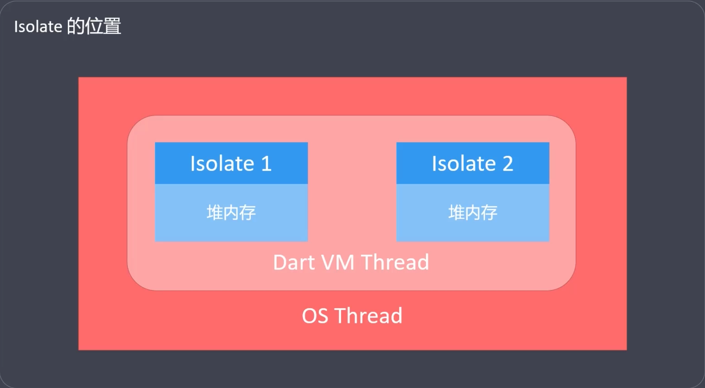
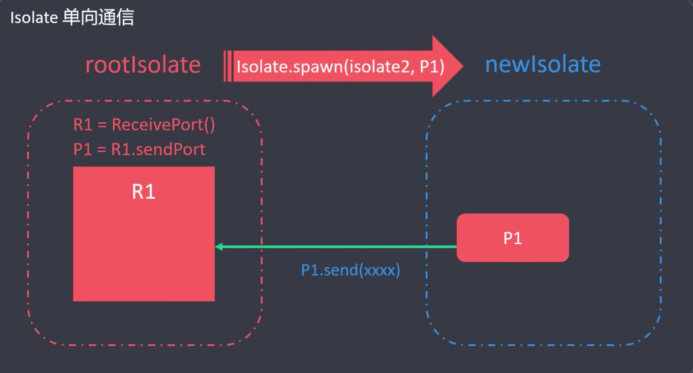
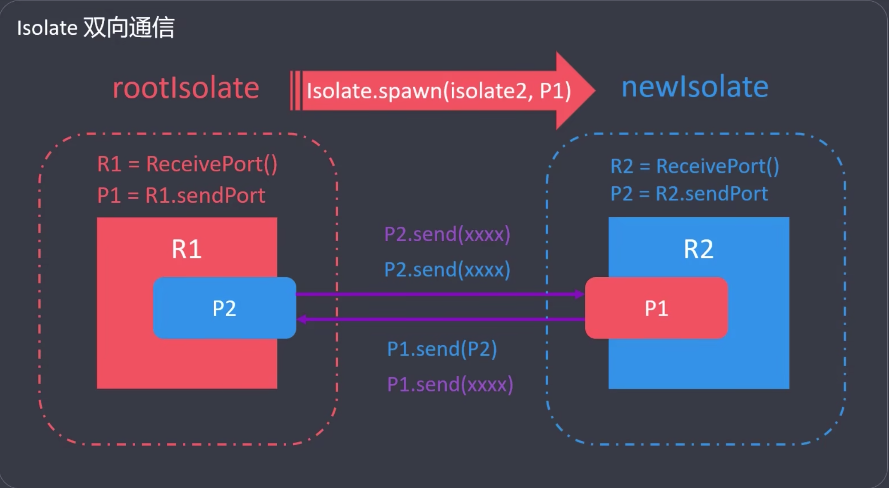

# Dart 异步编程
## 单线程 (EventLoop)
- `Dart`单线程的核心包括： 主线程，微任务和宏任务
  - 微任务队列
    - 微任务队列包含微任务，主要通过`scheduleMicrotask`来调度
  - 事件队列
    - 事件队列包含外部事件，例如I/O, Timer, 绘制事件等
- 同步与异步

## Isolate 多线程
- `Isolate`是 `Dart`中的线程
  - `Dart` 中的线程是以`隔离(Isolate)`  的方式存在的
  - 每个 `Isolate` 都有自己独立的，私有的内存块(`多个线程不共享内存`)
  - 没有共享内存，就不需要竞争资源，就不需要锁(不用担心死锁问题)
- 所有的Dart代码，都运行在`Isolate`中
  - `Isolate`提供了 Dart | Flutter 的运行环境
  - 微任务队列，事件队列，事件轮询(EventLoop)都在Isolate中运行
- 多线程经常用来解决耗时比较长的异步任务
- Isolate 的位置

### Isolate 多线程 - 创建
- `Isloate 类`用来管理线程(创建、暂停、杀死Isolate线程)
  - `Isolate.spawn()`
  - `Isolate.spawnUri()`
  - `Isolate.pause()`
  - `Isolate.kill()`
   
`Future<Isolate> Isolate.spawn(entryPoint, message)`
- `import 'dart:isolate';`
- entryPoint (必须是一个顶层方法或静态方法)
- message 
  1. Dart原始数据类型，null,bool,int,double,String
  2. SendPort实例 - ReceivePort().sendPort
  3. 包含1和2的list和map, 也可以嵌套
`compute()`
- `import 'package:flutter/foundation.dart'`

### 多线程 - 通信机制
- `Isolate`多线程之间，通信的唯一方式是`Port`
- `ReceivePort`类
  - 初始化接收端口，创建发送端口，接收消息，监听消息，关闭端口
- `SendPort`类
  - 将消息发送给`ReceivePort`
- 通信方式 
  - 单向通信 (A->B)
  
  - 双向通信 (A<->B)
  

## Future
### 什么是 Future
- 概念
  - Future 是 Dart 中的类，我们可以通过Future实例，封装一些异步任务
  - Future 的含义是未来。未来要执行的一些任务，我们可以放到Future中
- Future 有三种状态： 未完成(`Uncompleted`), 已完成，并返回数据 (`Completed with data`) ,已完成，但返回报错 (`Completed with error`)  
### 获取 Future 实例
- 自动返回
```dart
final myFuture = http.get('https://my.image.url');
final myFuture = SharedPreferences.getInstance;
```
- 手动创建
```dart
final myFuture = Future(() { return 123; })
final myFuture = Future.error(Exception());
final myFuture = Future.delayed(Duration(sections: 5), () => 123);
``` 
### Future 状态相关的方法
- 创建 `Uncompleted`
- then() `Completed with data`
- catchError() `Completed with error`
- whenComplete() `Completed with data` + `Completed with error`

### Future 执行顺序
- Future 默认是异步任务，会被丢到事件队列(event queue)中
- Future.sync()
  - 同步任务，同步执行（不会被丢到异步队列中）
- Future.microtask()
  - 微任务， 会丢到 microtask queue 中，优先级比事件任务高
- Future。value(val)
  - val 是常量 (等同于microtask)
  - val 是异步 (按照异步逻辑处理)
### Future 多任务
- Future.any(futures)
  - 返回最先完成的 `Future` 结果
- Future.wait(futures)
  - 等待所有 `Future` 执行完成，并收集所有 `Future` 的返回结果
- Future.doWhile(action)
  - 按照条件遍历执行多个`Future`
- Future.forEach(elements, action)
  - 遍历一个给的集合，根据集合元素执行多个`Future`

### FutureBuilder
- `FutureBuilder` 是 Flutter SDK 中提供的异步组件
  - `FutureBuilder` 是一个类，接收 Future 数据， 并将数据渲染成界面
  - `import 'package:flutter/material.dart'`
- `FutureBuilder` 中，有三个属性
  - future
  - initialData
  - builder(context, snapshot)
### snapshot
- snapshot.connectionState
  - ConnectionState.none (未连接异步任务)
  - ConnectionState.waiting (连接异步任务，等待交互)
  - ConnectionState.active (正在交互)
  - ConnectionState.done (异步任务完成)
- snapshot.hasData (Completed with data)
  - snapshot.data
- snapshot.hasError (Completed with error)
## Stream
## async/await
## Generator