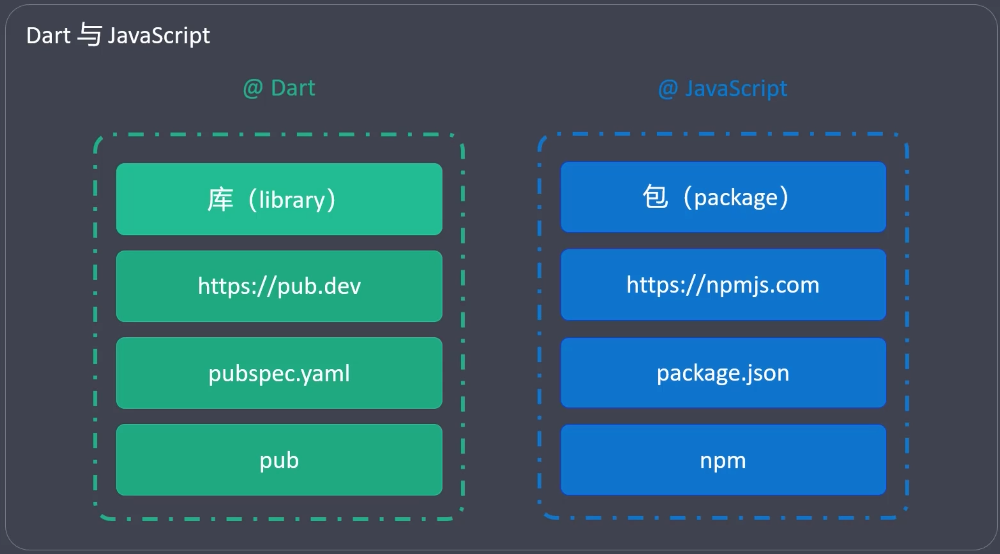
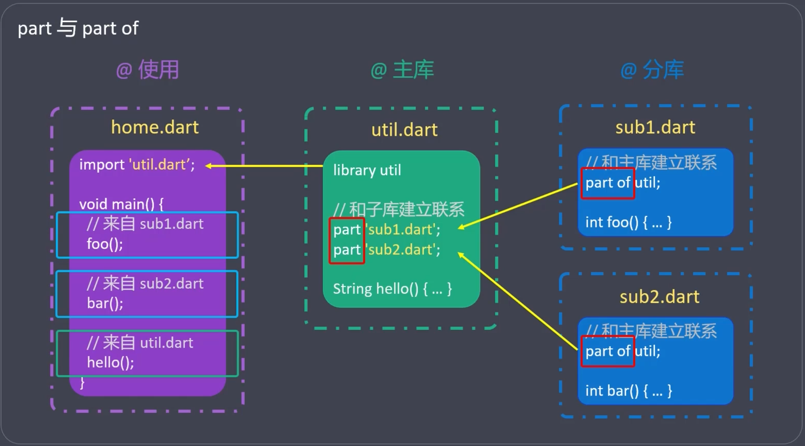
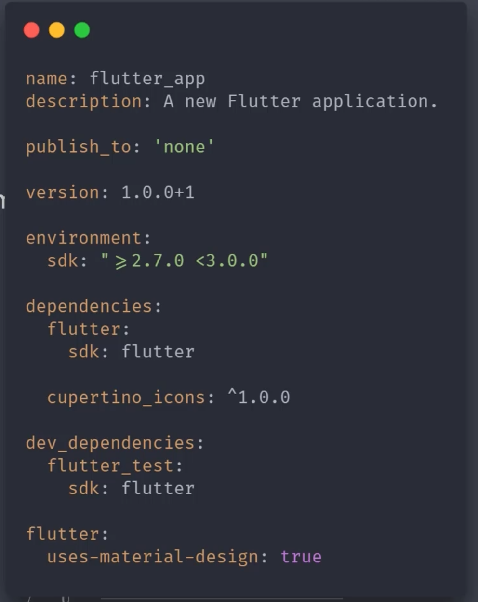

# 库 与 生态
```
简介， 自定义库， 系统库， 第三方库
```
## 简介
- `Dart`中的库就是具有特定功能的模块
  - 可能包含单个文件，也可能包含多个文件。
- 按照库的作者进行划分，库可以分为三类
  - 自定义库（工程师自己写的）
  - 系统库 （Dart自带的）
  - 第三方库 （Dart生态中的）
- `Dart` 生态
  - `https://pub.dev/`
  - `pub`命令 


## 自定义库
### 通过 library 来声明库
- 每个`Dart` 文件默认都是一个库，只是没有使用library 来显式声明。
```dart
// mian.dart
// library main;   // 默认隐藏了一个mian 的library的声明

void main(List<String> args) {...}
```
- `Dart`使用`_`（下划线）开头的标识符，表示库内访问可见(私有)
- `library` 关键字声明的库名称建议使用： 小写字母 + 下划线
### 通过 import 来引入库
- 不同类型的库，引入方式不同
  - 自定义库(`import '库的位置/库名称.dart'`)
  - 系统库(`import 'dart:库名称'`)
  - 第三方库
- 引入部分库（仅引入需要的内容）
  - 包含引入(`show`)
  - 排除引入(`hide`)
- 指定库的前嘴
  - 当库名冲突时，可以通过`as`关键字，给库声明一个前缀
- 延迟加载(懒加载)
  - 使用`deferred as` 关键字来标识需要延时加载的库

### 通过 part '../lib'和 part of 来组装库


## 系统库

## 第三方库
- 来源
  - https://pub.dev
  - https://pub.flutter-io.cn/packages
  - https://pub.dartlang.org/flutter
- 使用
  - 在项目目录下创建`pubspec.yaml`
  - 在 `pubspec.yaml`中声明第三方库（依赖）
  - 命令行中进入`pubspec.yaml`所在目录，执行`pub get`进行安装
  - 项目中引入已安装的第三方库(`import 'package:xxxx/xxxx.dart'`)
### 第三方库 的结构
- 一个第三方库，必须包含一个`pubspec.yaml`
  
- pubspec.yaml
  - 详情 https://dart.cn/tools/pub/pubspec
  