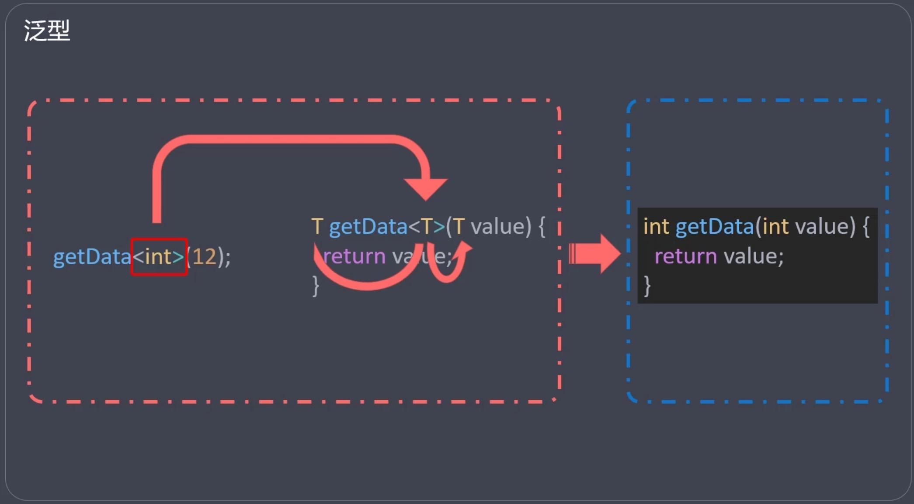

# 类
- 类是通过`class`声明的代码段，包含属性和方法
  - 属性：用来描述类的变量
  - 方法：类中的函数称为类的方法

- 对象是类的实例化的结果（var obj = new MyClass()）
- 编程方式
  - 面向对象编程（OOP）
  - 面向过程编程（POP）


## 构造函数
- 默认构造函数
  -  与类同名的函数， 在实例化时，自动被调用 
- 命名构造函数
  - 在类中使用命名构造器`类名.函数名`实现多个构造器，可以提供额外的清晰度 
- 常量构造函数
  - 如果类生成的对象不会改变，可以通过常量构造函数使这些对象成为编译时常量
- 工厂构造函数
  - 通过`factory`声明，工厂函数不会自动生成实例，而是通过代码来决定返回的实例。

## 访问修饰符
- `Dart` 与 `Typescript` 不同，没有访问修饰符(`public`, `protected`, `private`)
- `Dart` 类中，默认的访问修饰符是公开的(即 `public`)
- 如果`属性`或`方法`以 `_` (下划线)开头，则表示私有(即 `private`)
- **只有把类单独抽离出去，私有属性和方法才起作用**

## Getter 与 Setter
- `Getter`(获取器) 时通过get关键字修饰的方法
  - 函数没有小括号， 访问时也没有小括号(像访问属性一样)
- `Setter`（修改器）是通过set关键字修饰的方法
  - 访问时，像设置属性一样给函数传参


## 初始化列表
- 作用：在构造函数中设置属性的默认值
- 时机：在构造函数体执行之前执行
- 语法：使用逗号分隔初始化表达式
- 场景：常用于设置final常量的值
```dart
class Rect {
  int height;
  int width;

  Rect(): height = 2, width = 10 {
    print("${this.height} - ${this.width}");
  }
  getArea () {
    return this.height * this.width;
  }
}
```
## static
- `static` 关键字用来指定静态成员
  - 通过 `static` 修饰的属性是静态属性
  - 通过 `static` 修饰的方法是静态方法
- 静态成员可以通过类名称直接访问（不需要实例化）
  - 实例化是比较消耗资源的，声明静态成员，可以提高程序性能
- 静态方法不能访问非静态成员，非静态方法可以访问静态成员
  - 静态方法中不能使用this关键字
  - 不能使用this关键字，访问静态属性


## 元数据
- 元数据以`@`开头，可以给代码标记一些额外的信息
  - 元数据可以用来`库`,`类`,`构造器`,`函数`,`字段`,`参数`或`变量`声明的签名

  - @override (重写)
  - @required (必填)
  - @deprecated (弃用)

## 继承 
- 根据类的先后顺序，可以将类分成`父类`和`子类`
- 子类通过`extends`关键字`继承`父类
  - 继承后，子类可以使用父类中，可见的内容(属性或方法)
- 子类中，可以通过`@override`元数据来标记"覆写"方法
  - "覆写"方法：子类中与父类中同名的方法
- 子类中，可以通过`super`关键字来引用父类中，可见的内容
  - 属性
  - 方法（普通构造函数，命名构造函数）

## 抽象类
- 抽象类是用 `abstract` 关键字修饰的类
- 抽象类的作用是充当普通类的模板，约定一些必要的属性和方法
- `抽象方法`是指**没有方法体的方法**
  - 抽象类中一般都有抽象方法，也可以没有抽象方法
  - 普通类中，不能有抽象方法
- 抽象类不能被实例化（不能被 new）
- 抽象类可以被普通类继承(`extends`)
  - 如果普通类继承抽象类，必须**实现抽象类中所有的抽象方法**
- 抽象类还可以充当接口被实现(`implements`)
  - 如果把抽象类当做接口来实现的话，普通类必须得**实现抽象类里面定义的所有属性和方法**

## 接口
- 接口在 `Dart` 中就是一个类(只是用法不同)
  - 与 `java` 不同，`java`中的接口需要用`interface`关键字来声明； `Dart` 中不需要
  - 接口可以是任意类，但一般 使用抽象类做接口
- 一个类可以实现(`implements`)多个接口，多个接口用逗号分隔
  - `class MyClass implements interface1, interface2 {...}`
  - 接口可以看成一个个小零件。类实现接口就相当于组装零件。
- 普通类实现接口后，必须重写接口中所有的属性和方法

## 混入(Mixin)
- 混入(`Mixin`)是一段公共代码。混入有两种声明方式
  1.  将类当做混入 `class MixinA {...}`
    - 作为 `Mixin` 的类只能继承自 `Object` ，不能继承其他类
    - 作为 `Mixin` 的类不能有构造函数
  2. 使用 `mixin` 关键字声明 `mixin MixinB {...}`
- 混入(`Mixin`)可以提高代码复用的效率，普通类可以通过 `with`来使用混入
  - `class MyClass width MixinA, MixinB {...}`
- 使用多个混入时，后引入的混入会覆盖之前混入中的重复的内容
  - MixinA 和 MixinB 中都有Hello()方法，MyClass会使用MixinB中的

## 泛型(generics)
- 泛型是在**函数，类，接口**中指定宽泛数据类型的语法
  - 泛型函数
  - 泛型类
  - 泛型接口
- 通常，在尖括号中，使用一个字母来代表类型，例如A、T、S、K和V等

```dart
T getData<T> (T value) {
  return value
}
```
- 作用：使用泛型可以减少重复代码

## 枚举(enum)
- 枚举是数量固定的常量值， 通过`enum`关键字声明
```dart
enum Color { red, green, blue }
```

- 枚举的 `values` 常量， 可以获取所有枚举值列表
```dart
List<Color> colors = Color.values
```

- 可以通过index获取值的索引
```dart
asset(Color.green.index == 1);
```